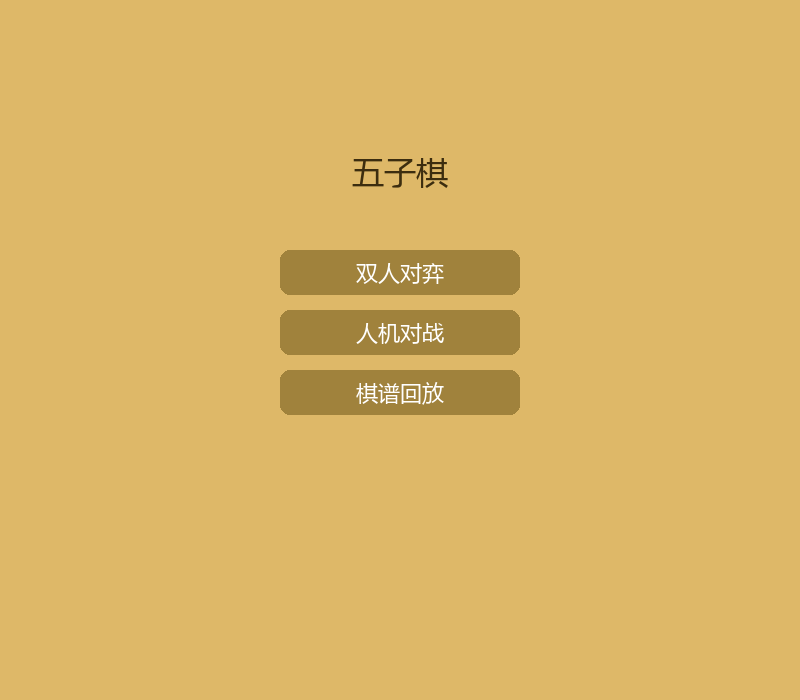
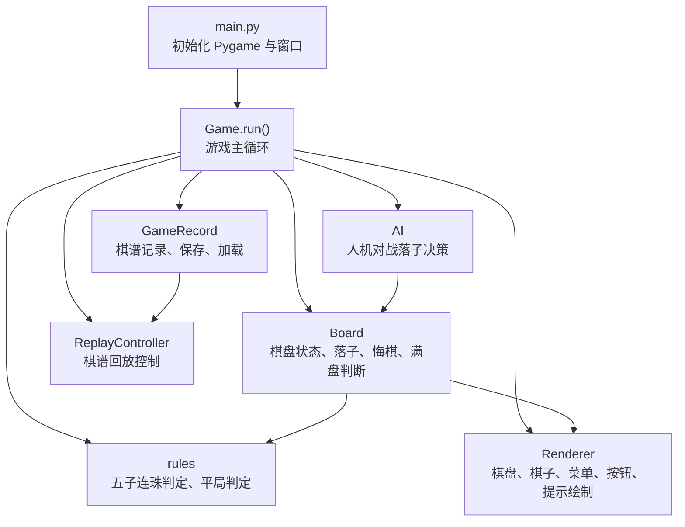
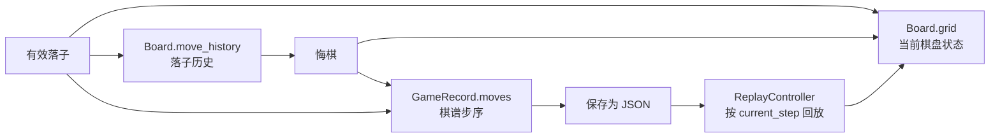
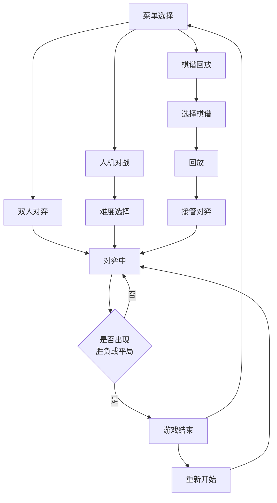
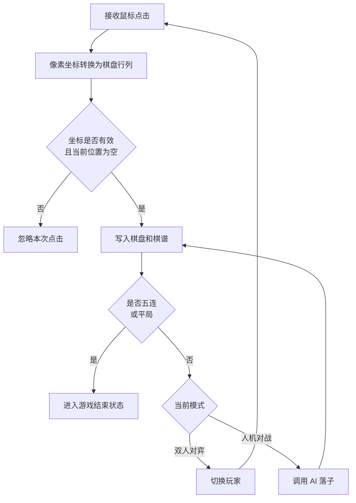
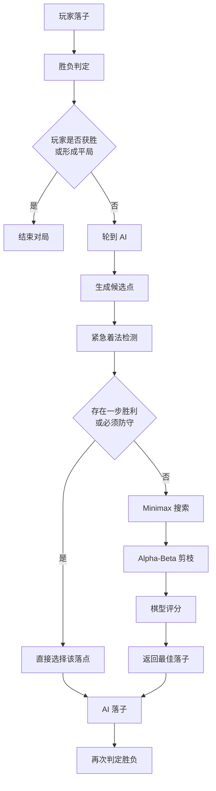
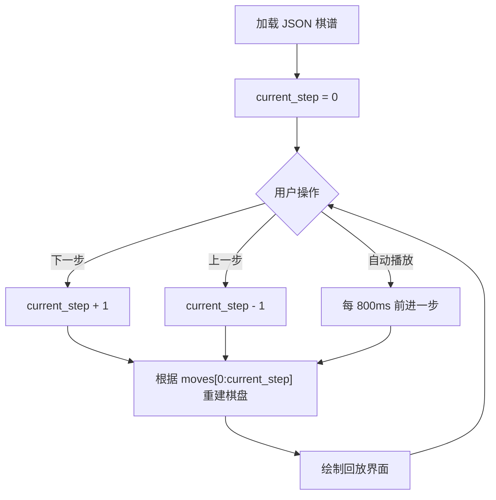
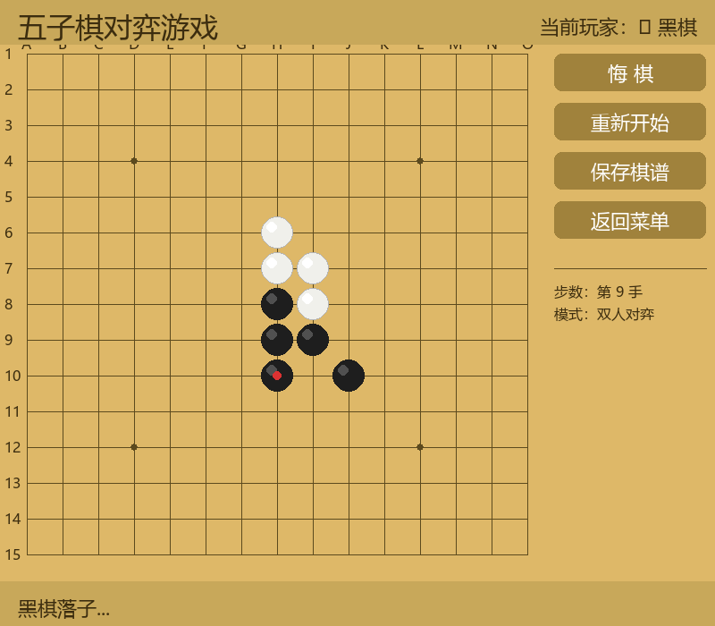
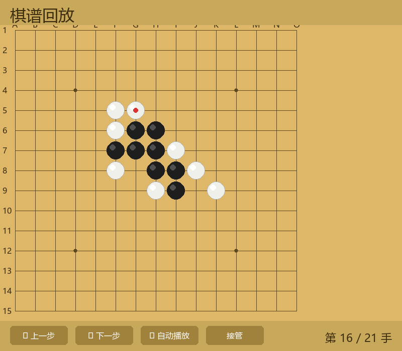

# 题目：五子棋游戏

## 摘要

本论文围绕“五子棋游戏”的课程设计任务，基于 Python 语言和 Pygame-CE 图形库实现一款桌面端五子棋对弈游戏。系统采用模块化设计，将游戏主循环、棋盘数据结构、落子控制、胜负判定、界面绘制、棋谱管理和人机对战 AI 分离实现。游戏支持双人对弈、人机对战和棋谱回放三种模式，提供 15x15 标准棋盘绘制、鼠标点击落子、落子合法性检查、五子连珠判定、平局判定、悔棋、重新开始、棋谱保存、经典棋谱学习和窗口缩放等功能。

在数据结构方面，系统使用二维列表表示棋盘状态，使用列表记录落子历史，使用 JSON 文件存储棋谱数据。在算法方面，胜负判定算法以最后落子为中心，分别沿横向、纵向和两条对角线统计连续同色棋子；人机对战部分使用 Minimax 搜索、Alpha-Beta 剪枝、候选点裁剪和棋型评分函数选择落子。测试结果表明，系统能够完成课程题目要求的核心功能，并具备较好的可读性、可维护性和扩展性。

**关键词：** 五子棋；Python；Pygame；胜负判定；棋谱回放

## ABSTRACT

This paper describes the design and implementation of a Gomoku game based on Python and the Pygame-CE library. The system separates the main game loop, board model, move control, win detection, rendering, record management, and AI opponent into independent modules. It supports player-versus-player mode, player-versus-AI mode, and game-record replay mode. The main features include a 15x15 board, mouse-based move placement, legal move validation, five-in-a-row detection, draw detection, undo, restart, record saving, classic record replay, and resizable window rendering.

The board is represented by a two-dimensional list, the move history is stored in a list, and game records are serialized as JSON files. The win detection algorithm scans four directions from the latest move. The AI module uses Minimax search with Alpha-Beta pruning, candidate move filtering, and pattern-based evaluation. The test design shows that the system satisfies the functional requirements of the course project and provides a clear foundation for further improvement.

**Key words:** Gomoku; Python; Pygame; win detection; game record replay

## 目 录

- [第1章 需求分析](#第1章-需求分析)
- [第2章 逻辑结构和存储结构分析](#第2章-逻辑结构和存储结构分析)
- [第3章 算法设计与实现](#第3章-算法设计与实现)
- [第4章 代码实现](#第4章-代码实现)
- [第5章 算法测试](#第5章-算法测试)
- [第6章 总结](#第6章-总结)
- [参考文献](#参考文献)
- [致谢](#致谢)

## 第1章 需求分析

### 1.1 问题描述

五子棋是一种规则清晰、交互直观的棋类游戏。双方在 15x15 棋盘交叉点上轮流落子，黑棋先行，任意一方在横向、纵向或斜向率先形成连续五枚同色棋子即获胜。当棋盘填满且双方均未形成五连时，判定为平局。

本项目的目标是使用 Python 开发一款可运行的五子棋对弈游戏[1]。项目采用 Pygame-CE 作为图形界面库[2]。系统不仅需要完成基础对弈和胜负判定，还需要具备悔棋、重新开始、棋谱保存、棋谱回放、经典棋谱学习和界面显示等完整功能[3]。项目当前依赖在 `requirements.txt` 中声明为 `pygame-ce>=2.5.7` 和 `pyinstaller>=6.13`，支持通过源码方式运行，也支持使用 PyInstaller 打包为 Windows 可执行程序[4]。

### 1.1.1 系统用户角色

本系统面向普通五子棋玩家和课程学习者，主要用户角色如下：

1. 双人对弈玩家：两名玩家在同一台设备上轮流落子，通过系统完成本地对局。
2. 人机对战玩家：单名玩家执黑棋，与系统内置 AI 进行对弈，并可选择简单、中等、困难三档难度。
3. 棋谱学习者：通过棋谱回放模式查看内置经典棋谱或用户保存棋谱，学习对局过程，并可从回放中途接管继续对弈。
4. 课程评审者：从功能完整性、数据结构、算法设计、代码实现和测试结果等角度评估项目完成情况。

### 1.1.2 功能描述

根据课程题目要求和当前项目实现，系统核心功能包括：

1. 游戏框架模块：由 `main.py` 初始化 Pygame 窗口，由 `game.py` 负责游戏主循环、模式选择、状态管理和模块调度。
2. 棋盘系统模块：由 `board.py` 管理 15x15 棋盘数据，提供重置、落子、悔棋、棋盘是否已满、获取棋子和最后一步等接口。
3. 落子控制模块：通过鼠标左键点击棋盘交叉点落子，由 `renderer.py` 完成像素坐标到棋盘坐标的转换，由 `Board.is_valid_move()` 判断落子是否合法。
4. 胜负判定模块：由 `rules.py` 提供 `check_win()` 和 `check_draw()`，实现五子连珠判定和棋盘满局判定。
5. 游戏功能模块：支持悔棋、重新开始、返回菜单、保存棋谱，以及人机模式下撤回玩家和 AI 各一步。
6. 界面显示模块：由 `renderer.py` 绘制棋盘、棋子、当前玩家提示、状态栏、侧边按钮、胜负提示和棋谱回放控制栏。
7. 棋谱系统模块：由 `history.py` 使用 JSON 记录、保存、加载和回放棋谱，内置 3 个经典棋谱文件。
8. 人机对战模块：由 `ai.py` 实现三档难度 AI，使用 Minimax、Alpha-Beta 剪枝、候选点裁剪和棋型评分。

系统启动后首先进入主菜单界面，用户可以从双人对弈、人机对战和棋谱回放三类入口开始使用。主菜单界面如图1.1所示。



图1.1 系统主菜单界面

表1.1列出了系统主要功能模块、实现文件和对应说明，便于从需求角度观察程序结构。

表1.1 系统功能模块对应关系

| 功能模块 | 主要实现文件 | 功能说明 |
|----------|--------------|----------|
| 游戏框架模块 | `main.py`、`game.py` | 初始化窗口，维护游戏状态机和主循环 |
| 棋盘系统模块 | `board.py` | 保存 15x15 棋盘、落子历史，并支持重置和悔棋 |
| 胜负判定模块 | `rules.py` | 根据最后一步落子检查四个方向五连和平局 |
| 界面显示模块 | `renderer.py` | 绘制棋盘、棋子、菜单、按钮、状态栏和回放控制栏 |
| 棋谱系统模块 | `history.py`、`paths.py` | 使用 JSON 保存、加载、列出和回放棋谱 |
| 人机对战模块 | `ai.py` | 根据难度执行候选点裁剪、Minimax 搜索和 Alpha-Beta 剪枝 |

### 1.2 需求分析

从功能需求看，系统必须保证玩家能完成完整对局：开始游戏、选择模式、落子、判定胜负、悔棋、重新开始和保存棋谱。对棋盘操作而言，系统需要严格限制落子范围，避免同一交叉点重复落子，并在每次有效落子后及时判定胜负或平局。

从交互需求看，系统需要将 15x15 棋盘、黑白棋子、当前玩家、操作按钮和状态提示清晰呈现给用户。当前项目使用 `pygame.RESIZABLE` 创建可缩放窗口，并在 `renderer.py` 中根据窗口大小动态计算棋盘、棋子、按钮和字体尺寸，使窗口变化后鼠标坐标仍能正确映射到棋盘位置。

从数据需求看，棋盘状态需要支持快速读取和修改，落子历史需要支持撤销，棋谱需要持久化保存并可被重新加载。项目采用二维列表保存棋盘，采用列表保存落子历史，采用 JSON 文件保存棋谱，既符合课程对数据结构的要求，也便于调试和扩展。

从算法需求看，胜负判定需要高效且准确。由于五子棋的胜负只可能由最后一步落子触发，因此系统无需每次扫描整个棋盘，只需围绕最后落子检查四个方向。人机对战 AI 需要在可接受时间内给出合理落子，因此项目对候选点进行裁剪，只搜索已有棋子周围 2 格范围内的空位，并结合 Alpha-Beta 剪枝减少搜索分支。

## 第2章 逻辑结构和存储结构分析

### 2.1 逻辑结构分析

#### 2.1.1 整体系统功能逻辑

系统以 `Game` 类为调度中心，运行时不断接收 Pygame 事件、更新游戏状态并调用渲染器绘制界面[2]。当前实现包含五类主要状态。整体组织方式符合有限状态机在交互程序中的常见设计思路[5]：

1. `menu`：主菜单状态，提供“双人对弈”“人机对战”“棋谱回放”入口。
2. `difficulty`：人机对战难度选择状态，提供简单、中等、困难三档选项。
3. `playing`：对弈状态，处理玩家落子、AI 落子、悔棋、保存和重新开始。
4. `game_over`：游戏结束状态，显示胜负或平局结果，并支持重新开始或返回菜单。
5. `replay_select` / `replay`：棋谱选择和棋谱回放状态，支持上一步、下一步、自动播放和接管对局。

系统逻辑结构如下：



图2.1 系统模块逻辑结构图

#### 2.1.2 核心数据对象逻辑

系统的核心数据对象包括棋盘、棋子、落子历史、棋谱和游戏状态。

棋盘对象由 `Board` 类维护，内部 `grid` 是 15 行 15 列的二维列表。列表元素使用整数表示棋盘状态：`0` 表示空位，`1` 表示黑棋，`2` 表示白棋。由于五子棋棋盘大小固定，二维列表结构简单直接，能够以 `grid[row][col]` 的形式快速定位任意交叉点。

落子历史由 `move_history` 列表保存，每个元素是 `(row, col, color)` 三元组。该结构天然支持栈式撤销，悔棋时只需弹出最后一步并将对应棋盘位置恢复为空。

棋谱对象由 `GameRecord` 管理，包含 `meta` 和 `moves` 两部分。`meta` 保存日期、模式、难度、结果和总步数，`moves` 保存每一步的步号、颜色和坐标。棋谱使用 JSON 文件存储，可读性强，便于保存、回放和人工检查。

#### 2.1.3 数据关系逻辑

系统中棋盘、落子历史和棋谱之间存在一致性关系。每次有效落子后，`Board.place()` 会更新 `grid` 并追加到 `move_history`，随后 `GameRecord.add_move()` 会同步记录该步棋。当用户悔棋时，`Board.undo()` 删除棋盘历史，`GameRecord.undo_moves()` 删除棋谱历史，从而保证界面显示、胜负判定和棋谱保存的数据一致。

在棋谱回放状态下，系统不直接使用当前对局的历史，而是通过 `ReplayController.current_step` 表示回放进度。每次绘制回放界面时，程序从棋谱开头到当前步重建棋盘状态。这样可以保证上一步、下一步和自动播放的结果都由同一份棋谱数据驱动。

核心数据对象之间的同步关系如下：



图2.2 核心数据对象同步关系图

#### 2.1.4 逻辑结构示意图



图2.3 游戏状态流转图

### 2.2 存储结构分析

#### 2.2.1 棋盘存储结构：二维列表

棋盘采用 15x15 二维列表：

```python
grid = [[EMPTY] * BOARD_SIZE for _ in range(BOARD_SIZE)]
```

该结构与五子棋棋盘天然对应，行列坐标含义清晰。访问某个交叉点的时间复杂度为 O(1)，判断落子是否合法只需检查坐标范围和当前位置是否为空。

#### 2.2.2 落子历史存储结构：列表栈

落子历史采用列表保存：

```python
move_history = [(row, col, color), ...]
```

列表尾部表示最近一步棋。悔棋时执行弹出操作，并将棋盘对应位置恢复为 `EMPTY`。这种结构适合“后进先出”的悔棋场景，逻辑简单、效率较高。

#### 2.2.3 棋谱存储结构：JSON 文件

棋谱文件存储在 `records/classic` 和 `records/saved` 中。`records/classic` 保存内置经典棋谱，当前包含 3 个 JSON 文件；`records/saved` 保存用户对局棋谱。棋谱结构如下：

```json
{
  "meta": {
    "date": "2026-05-30 12:00",
    "mode": "pvp",
    "difficulty": "",
    "result": "黑胜",
    "total_moves": 35
  },
  "moves": [
    {"step": 1, "color": "black", "pos": [7, 7]},
    {"step": 2, "color": "white", "pos": [8, 8]}
  ]
}
```

JSON 格式兼具可读性和结构化特点，既可以由程序读取，也便于人工检查[6]。当前内置经典棋谱包括 38 手白胜、21 手黑胜和 53 手黑胜三局。

#### 2.2.4 存储结构与逻辑结构的映射关系

二维列表负责当前棋盘状态，落子历史负责撤销，JSON 棋谱负责持久化和回放。三者分别对应“当前状态”“操作过程”和“长期保存”三个层次。对局过程中，用户每下一步棋都会同时改变棋盘状态和历史记录；保存棋谱时，历史记录被序列化为 JSON；回放棋谱时，JSON 中的步序又被重新转换为棋盘状态。

表2.1展示了主要数据结构与程序逻辑之间的对应关系。

表2.1 核心数据结构与用途

| 数据对象 | 存储结构 | 典型内容 | 主要用途 |
|----------|----------|----------|----------|
| 棋盘状态 | 15x15 二维列表 | `grid[row][col]` | 快速读取和更新任意交叉点 |
| 落子历史 | 列表栈 | `(row, col, color)` | 支持悔棋、统计步数和标记最后一步 |
| 棋谱数据 | JSON 对象 | `meta`、`moves` | 保存对局、加载经典棋谱和逐步回放 |
| 回放进度 | 整数索引 | `current_step` | 控制上一手、下一手、自动播放和接管 |

#### 2.2.5 存储结构的优势分析

二维列表结构直观、访问速度快，适合固定大小棋盘。列表栈适合悔棋，因为每次撤销都只处理最近一步。JSON 文件便于跨运行周期保存对局，且不依赖数据库。对于课程项目而言，这些结构既能体现数据结构思想，又不会引入过高复杂度。

### 2.3 核心算法与存储结构的适配性

胜负判定算法依赖二维列表按行列访问的能力，能够从最后落子位置向四个方向快速读取相邻棋子。悔棋算法依赖落子历史的栈结构，可以在 O(1) 时间内找到最近一步。棋谱回放依赖 JSON 中按步序排列的 `moves` 列表，可以从第 1 步逐步重建任意回放进度下的棋盘。

AI 算法也与二维列表结构紧密相关。候选点生成时，AI 会扫描棋盘上的已有棋子，并把其周围 2 格范围内的空位加入候选集合；搜索过程中通过 `Board.place()` 和 `Board.undo()` 反复尝试和回退落子，使 Minimax 搜索能够复用同一套棋盘数据结构。

## 第3章 算法设计与实现

### 3.1 算法设计

#### 3.1.1 算法基本思想与设计思路

本系统的算法设计围绕五个问题展开：如何将鼠标点击转换为棋盘坐标，如何判断落子是否合法，如何判断胜负和平局，如何支持悔棋与棋谱回放，如何让 AI 给出合理落子。

坐标转换算法由渲染器完成。界面绘制时，系统根据虚拟棋盘坐标、当前窗口大小和缩放比例计算每个交叉点的像素位置；鼠标点击时，再将像素位置反向转换为行列坐标。由于窗口支持缩放，算法不能简单使用固定像素值，而需要通过当前布局比例重新计算。

合法落子算法由棋盘模块完成。只有当坐标位于 0 到 14 的范围内，且对应位置为空位时，落子才被允许。该规则避免越界落子和重复落子。

胜负判定算法以最后一步落子为中心。由于只有最新落子可能形成新的五连，因此不需要扫描所有棋子。算法在水平、垂直、左上到右下、右上到左下四个方向上分别统计连续同色棋子数量，只要任意方向达到 5，即判定当前颜色获胜。

AI 算法采用 Minimax 搜索进行博弈决策[7]。搜索过程中结合 Alpha-Beta 剪枝减少无效分支[8]。AI 先生成候选点，再检测是否存在立即获胜或必须防守的位置；若不存在紧急着法，则递归模拟双方落子，根据棋型评分函数评估局面。为了控制计算量，候选点只取已有棋子周围 2 格内的空位，并按照局部评分排序后截取前若干个。

#### 3.1.2 算法实现思路

对弈流程如下：



图3.1 对弈流程图

人机对战流程如下：



图3.2 人机对战流程图

棋谱回放流程如下：



图3.3 棋谱回放流程图

表3.1对三个主要流程的输入、处理和输出进行了概括。

表3.1 主要算法流程概括

| 流程 | 输入 | 关键处理 | 输出 |
|------|------|----------|------|
| 玩家落子流程 | 鼠标点击坐标 | 坐标转换、合法性检查、写入棋盘、胜负判定 | 新棋盘状态或游戏结束状态 |
| AI 决策流程 | 当前棋盘状态 | 候选点生成、紧急着法检测、Minimax 搜索、剪枝评估 | AI 最优落子坐标 |
| 棋谱回放流程 | JSON 棋谱和当前步数 | 读取前 k 步落子并重建棋盘 | 指定步数下的棋盘画面 |

### 3.2 算法具体实现

#### 3.2.1 棋盘坐标转换算法

`renderer.py` 中 `_grid_to_px()` 将棋盘行列转换为像素坐标，`_px_to_grid()` 将鼠标像素坐标转换为棋盘行列。转换时先根据窗口大小计算缩放比例，再对虚拟坐标进行缩放。

鼠标点击转行列的关键步骤如下：

1. 判断点击点是否在内容区域内。
2. 将真实像素坐标转换回虚拟坐标。
3. 使用四舍五入计算最近的棋盘行列。
4. 检查行列是否在 15x15 范围内。
5. 计算点击点与交叉点的距离，距离在半个格距以内才视为有效点击。

该算法保证了用户点击交叉点附近时可以落子，同时避免点击棋盘空白区域误触发。

#### 3.2.2 落子合法性检查算法

`Board.is_valid_move(row, col)` 判断落子是否合法。算法条件包括：

1. `row` 和 `col` 均在 `[0, 14]` 范围内。
2. `grid[row][col]` 当前为空位。

若检查通过，`Board.place()` 将当前位置写入棋子颜色，并把 `(row, col, color)` 添加到 `move_history`。若检查不通过，函数返回 `False`，游戏状态不发生变化。

#### 3.2.3 胜负判定算法

`rules.py` 中 `check_win(grid, row, col)` 负责胜负判定。算法使用四个方向：

```python
DIRECTIONS = [(0, 1), (1, 0), (1, 1), (1, -1)]
```

对每个方向，算法从最后落子位置开始，分别向正向和反向统计连续同色棋子数。若正反两个方向加上自身后总数大于等于 5，则返回获胜方颜色；否则返回 `None`。

该算法只检查与最后落子相关的线段。设棋盘边长为 n，则单次判定最多在 4 个方向上各扫描正反两侧，时间复杂度为 O(n)，空间复杂度为 O(1)。在本项目中 n=15，实际计算量很小。

平局判定由 `check_draw(grid)` 完成。该函数扫描整个棋盘，只要存在空位就返回 `False`；若所有位置都非空，则返回 `True`。平局判定时间复杂度为 O(n²)，空间复杂度为 O(1)。

#### 3.2.4 悔棋算法

悔棋功能由 `Board.undo()` 和 `Game._undo()` 共同完成。`Board.undo()` 从 `move_history` 末尾弹出最近一步，并将棋盘对应位置恢复为空。

双人对弈模式下，悔棋撤回一步，然后切换当前玩家。人机对战模式下，玩家始终执黑棋，AI 执白棋，因此悔棋会在步数足够时连续撤回两步，即撤回 AI 和玩家各一步，保证悔棋后仍轮到玩家操作。棋谱记录同步调用 `GameRecord.undo_moves()` 删除对应步数。

悔棋算法每撤回一步的时间复杂度为 O(1)，空间复杂度为 O(1)。

#### 3.2.5 棋谱保存与回放算法

棋谱记录由 `GameRecord` 完成。每次落子时调用 `add_move()` 追加一条记录，保存时调用 `save()` 将 `meta` 和 `moves` 写入 JSON 文件[6]。保存目录通过 `paths.py` 区分开发环境和打包环境，使源码运行和打包后都能找到正确路径[9]。PyInstaller 打包环境下的资源路径需要额外适配[4]。

回放由 `ReplayController` 控制。控制器保存当前步数 `current_step` 和总步数 `total_steps`。前进时 `current_step` 加一，后退时减一。界面绘制时，系统读取 `moves[:current_step]`，按顺序重建棋盘。自动播放通过计时器每 800 毫秒调用一次下一步。

棋谱回放重建棋盘的时间复杂度为 O(k)，其中 k 为当前回放步数；空间复杂度主要由棋谱列表和棋盘二维列表决定，为 O(m+n²)，其中 m 为棋谱总步数，n 为棋盘边长。

#### 3.2.6 AI 搜索算法

`ai.py` 中 AI 的难度配置如下：

表3.2 AI 难度配置

| 难度 | 搜索深度 | 候选点数量 | 随机性 |
|------|----------|------------|--------|
| easy | 2 | 5 | 有 |
| medium | 3 | 8 | 无 |
| hard | 4 | 10 | 无 |

AI 首先生成候选点。如果棋盘为空，AI 默认选择天元 `(7, 7)`。候选点生成算法扫描所有已有棋子，并将其周围 2 格范围内的空位加入集合，再根据局部评分排序并截取指定数量。这样可以避免在 225 个交叉点中盲目搜索。

AI 决策流程如下：

1. 生成候选点。
2. 检查己方是否存在一步获胜位置，若存在则直接落子。
3. 检查对手是否存在一步获胜位置，若存在则优先防守。
4. 对候选点逐一模拟落子，调用 Minimax 搜索。
5. 使用 Alpha-Beta 剪枝提前终止无意义分支。
6. 根据评分选择最优落子，简单模式在同分候选中加入随机性。

评分函数基于棋型分值，主要包括连五、活四、冲四、活三、眠三、活二和眠二。局面评分采用“AI 棋型得分 - 对手棋型得分”的思路，使 AI 同时考虑进攻和防守。

若平均候选点数量为 b，搜索深度为 d，则普通 Minimax 的时间复杂度约为 O(b^d)。Alpha-Beta 剪枝在较好排序下可以显著减少实际搜索节点。项目通过候选点裁剪把 b 控制在 5 到 10 左右，使 AI 能够在桌面游戏交互中保持可接受响应速度。

### 3.3 算法分析

#### 3.3.1 时间复杂度分析

表3.3 主要功能时间复杂度

| 功能 | 主要算法 | 时间复杂度 |
|------|----------|------------|
| 坐标转换 | 像素坐标到行列坐标 | O(1) |
| 合法落子检查 | 范围和空位检查 | O(1) |
| 单次落子 | 写入二维列表和历史列表 | O(1) |
| 胜负判定 | 四方向连续棋子扫描 | O(n) |
| 平局判定 | 全棋盘扫描 | O(n²) |
| 悔棋 | 列表尾部弹出 | O(1) |
| 棋谱保存 | 序列化全部步数 | O(m) |
| 棋谱回放重建 | 重建当前前 k 步 | O(k) |
| AI 搜索 | Minimax + 剪枝 | 约 O(b^d) |

其中 n 为棋盘边长，项目中 n=15；m 为棋谱总步数；k 为当前回放步数；b 为候选点数量；d 为搜索深度。

#### 3.3.2 空间复杂度分析

棋盘二维列表空间复杂度为 O(n²)。落子历史最多保存 225 步，空间复杂度为 O(m)。棋谱保存时同样需要保存 m 条落子记录。胜负判定和合法性检查只使用少量临时变量，空间复杂度为 O(1)。AI 搜索递归深度为 d，递归栈空间复杂度为 O(d)，候选集合空间复杂度与候选点数量 b 相关。

## 第4章 代码实现

### 4.1 程序入口实现

程序入口位于 `main.py`。该文件负责初始化 Pygame，创建可缩放窗口，设置窗口标题，并实例化 `Game` 对象。窗口使用 `pygame.RESIZABLE` 标志创建，说明当前系统不仅支持默认尺寸，也支持用户拖动调整窗口大小。

入口文件代码较短，体现了职责分离原则：`main.py` 只负责启动，具体游戏逻辑全部交给 `game.py` 管理。

### 4.2 游戏框架模块实现

`game.py` 是系统核心模块，主要负责游戏状态机和主循环。`Game.run()` 每秒最多执行 60 帧，循环中处理退出事件、窗口缩放事件、键盘事件、鼠标点击事件、棋谱自动播放和 AI 落子，最后调用 `_draw()` 绘制当前状态画面。

游戏状态包括菜单、难度选择、对弈中、游戏结束、棋谱选择和棋谱回放。不同状态下，鼠标点击会被分发到不同处理函数。例如菜单状态下点击按钮进入对应模式，对弈状态下点击棋盘落子或点击侧边按钮执行悔棋、重新开始、保存棋谱和返回菜单。

### 4.3 棋盘系统模块实现

`board.py` 定义棋盘常量和 `Board` 类。`BOARD_SIZE` 为 15，`EMPTY`、`BLACK`、`WHITE` 分别表示空位、黑棋和白棋。`Board.reset()` 创建 15x15 空棋盘并清空历史。`Board.place()` 负责落子，落子成功后写入 `grid` 并记录到 `move_history`。

`Board.get()` 用于渲染器读取棋盘状态，`Board.last_move()` 用于获取最后一步位置并在界面上显示红色标记，`Board.move_count()` 用于显示当前步数和判断是否可以悔棋。

### 4.4 落子控制模块实现

落子控制由 `game.py` 和 `renderer.py` 配合完成。用户点击棋盘后，渲染器先将鼠标坐标转换为棋盘坐标。若转换结果有效，`Game._place_piece()` 调用 `Board.place()` 尝试落子。落子成功后，系统添加棋谱记录，调用胜负和平局判定，并根据结果进入游戏结束状态或切换玩家。

人机模式下，当系统检测到当前玩家为 AI 颜色时，会调用 `AI.get_move()` 获取 AI 落子，再复用 `_place_piece()` 完成落子和判定。这种设计避免了玩家落子和 AI 落子使用两套不同逻辑。

### 4.5 胜负判定模块实现

`rules.py` 单独提供胜负判定函数，使游戏规则与界面、输入和 AI 分离。`check_win()` 接收棋盘和最后落子坐标，返回获胜颜色或 `None`。`check_draw()` 判断棋盘是否已满。

该模块函数简单独立，适合进行单元测试，也便于后续扩展禁手规则、长连规则或其他棋类变体规则。

### 4.6 游戏功能模块实现

悔棋、重新开始、返回菜单和保存棋谱由 `game.py` 实现。悔棋功能根据对弈模式采用不同策略：双人模式撤回一步，人机模式撤回两步。重新开始会根据当前模式重新初始化棋盘、玩家、AI 和棋谱对象。保存棋谱会调用 `GameRecord.save()` 写入 JSON 文件，并在底部状态栏提示保存路径。

游戏结束后，系统会设置棋谱元信息，包括对局模式、难度、结果和总步数，便于后续保存和回放。

### 4.7 界面显示模块实现

`renderer.py` 负责所有界面绘制，包括棋盘格线、星位、坐标标注、棋子、最后落子标记、顶部提示栏、底部状态栏、侧边按钮、主菜单、游戏结束弹窗和棋谱回放控制栏。

棋盘绘制使用 15 条横线和 15 条竖线，坐标标注为 A 到 O 和 1 到 15。黑棋和白棋分别使用不同颜色和高光效果表现，最后一步使用红色圆点标记。窗口缩放时，渲染器根据当前窗口大小重新计算布局、线宽、棋子半径和字体大小，避免简单拉伸导致画面模糊。

对弈界面将棋盘区域、顶部状态提示、底部状态栏和右侧操作按钮放在同一窗口中，便于玩家在对局过程中完成悔棋、重新开始、保存棋谱和返回菜单等操作。实际对弈界面如图4.1所示。



图4.1 双人对弈界面

### 4.8 棋谱系统模块实现

`history.py` 实现棋谱系统。`GameRecord` 负责记录、撤销、保存、加载和列出棋谱。保存时使用 `json.dump(..., ensure_ascii=False, indent=2)`，保证中文文件内容可读。`ReplayController` 负责控制回放步数、自动播放状态和当前已播放落子。

`paths.py` 负责处理资源路径和用户数据路径[9]。开发环境下，经典棋谱从项目目录读取；PyInstaller 打包环境下，内置资源从 `_MEIPASS` 读取；用户保存棋谱写入可写目录，避免打包程序运行时无法保存数据[4]。

### 4.9 人机对战模块实现

`ai.py` 实现 AI 对手。AI 主要包含候选点生成、紧急着法检测、Minimax 搜索、Alpha-Beta 剪枝、局面评估和快速胜负判定。候选点裁剪降低搜索空间，紧急着法检测保证 AI 能够优先处理一步胜利和一步防守，棋型评分使 AI 能对不同局面做出相对合理的选择。

AI 模块与棋盘模块通过 `Board.place()` 和 `Board.undo()` 交互。搜索过程中，AI 会临时落子、递归评估、再撤销落子，从而在不破坏真实对局状态的前提下模拟未来局面。

## 第5章 算法测试

### 5.1 测试方案

本次测试围绕系统核心功能设计测试用例，覆盖游戏启动、模式选择、棋盘落子、合法性检查、胜负判定、平局判定、悔棋、重新开始、棋谱保存、棋谱回放、经典棋谱加载和源码语法检查等方面。测试目标是确认系统功能与课程要求一致，并验证核心数据结构和算法能够在典型场景下正确工作[10]。

表5.1给出了本次测试的基本环境和测试对象。

表5.1 测试环境与对象

| 项目 | 内容 |
|------|------|
| 操作系统 | Windows 桌面环境 |
| 开发语言 | Python 3 |
| 图形界面库 | Pygame-CE |
| 测试对象 | `main.py`、`game.py`、`board.py`、`rules.py`、`renderer.py`、`history.py`、`ai.py` |
| 主要数据文件 | `records/classic/*.json` |
| 测试方式 | 手工功能测试、典型局面构造、经典棋谱完整性检查、源码语法检查 |

### 5.2 测试用例与结果

表5.2 系统功能测试用例与结果

| 编号 | 测试项目 | 测试步骤 | 预期结果 | 测试结果 |
|------|----------|----------|----------|----------|
| TC01 | 游戏启动 | 运行 `python main.py` | 打开五子棋窗口并显示主菜单 | 通过 |
| TC02 | 双人对弈模式 | 点击“双人对弈” | 进入对弈界面，黑棋先手 | 通过 |
| TC03 | 人机对战模式 | 点击“人机对战”并选择难度 | 进入人机对战，玩家执黑，AI 执白 | 通过 |
| TC04 | 棋盘绘制 | 进入对弈界面 | 显示 15x15 棋盘、坐标和星位 | 通过 |
| TC05 | 鼠标落子 | 点击棋盘交叉点 | 对应位置绘制当前玩家棋子 | 通过 |
| TC06 | 重复落子检查 | 点击已有棋子位置 | 不允许覆盖原有棋子 | 通过 |
| TC07 | 越界落子检查 | 点击棋盘有效交叉点外区域 | 不产生棋子 | 通过 |
| TC08 | 横向胜利 | 构造同色横向五连 | 系统提示对应颜色获胜 | 通过 |
| TC09 | 纵向胜利 | 构造同色纵向五连 | 系统提示对应颜色获胜 | 通过 |
| TC10 | 斜向胜利 | 构造同色斜向五连 | 系统提示对应颜色获胜 | 通过 |
| TC11 | 平局判定 | 棋盘填满且无五连 | 系统提示平局 | 通过 |
| TC12 | 双人悔棋 | 双人模式落子后点击“悔棋” | 撤回最近一步并切换玩家 | 通过 |
| TC13 | 人机悔棋 | 人机模式玩家和 AI 均落子后点击“悔棋” | 同时撤回玩家和 AI 各一步 | 通过 |
| TC14 | 重新开始 | 对弈中点击“重新开始” | 清空棋盘并重置当前模式 | 通过 |
| TC15 | 保存棋谱 | 对弈后点击“保存棋谱” | 在 `records/saved` 生成 JSON 棋谱 | 通过 |
| TC16 | 棋谱回放 | 选择棋谱并点击下一步、上一步 | 棋盘按步数正确重建 | 通过 |
| TC17 | 自动播放 | 回放界面点击自动播放 | 棋谱每 800 毫秒自动前进一步 | 通过 |
| TC18 | 中途接管 | 回放若干步后点击接管 | 从当前局面进入对弈状态 | 通过 |
| TC19 | 经典棋谱完整性 | 扫描 `records/classic/*.json` | 坐标不越界且无重复落子 | 通过 |
| TC20 | 源码语法检查 | 使用 `ast.parse` 检查核心 `.py` 文件 | 核心 Python 文件可正常解析 | 通过 |

棋谱回放测试中，系统能够根据 JSON 棋谱的步序重建指定步数下的棋盘，并在底部显示上一步、下一步、自动播放和接管按钮。棋谱回放界面如图5.1所示。



图5.1 棋谱回放界面

### 5.3 数据分析

#### 5.3.1 时间复杂度分析

通过测试可以看出，落子、悔棋和坐标转换都属于常数时间操作，用户交互响应较快。胜负判定只围绕最后落子扫描四个方向，棋盘边长固定为 15，因此实际运行中几乎不会造成卡顿。平局判定需要扫描整个棋盘，但最多只有 225 个位置，计算量仍然较小。

AI 搜索是系统中计算量最大的部分。当前项目通过候选点裁剪和 Alpha-Beta 剪枝降低搜索复杂度，并根据难度限制搜索深度和候选点数量。简单、中等、困难三档分别使用 2、3、4 层搜索，兼顾了对弈体验和运行效率。

#### 5.3.2 空间复杂度分析

棋盘固定为 15x15 二维列表，空间开销稳定。落子历史和棋谱记录最多保存 225 步，空间占用较小。回放时系统根据当前步数重建棋盘，虽然会重复遍历部分落子，但在五子棋规模下开销可以接受。AI 搜索主要消耗递归栈和候选点集合空间，受搜索深度和候选数量限制。

### 5.4 调试过程问题分析

在实现和验证过程中，需要重点关注以下问题：

1. 窗口缩放后的坐标偏移问题。若直接使用固定像素坐标，窗口大小变化后鼠标点击会与棋盘交叉点不一致。当前系统通过缩放布局和反向坐标转换解决该问题。
2. 棋谱与棋盘状态不一致问题。若悔棋时只撤销棋盘而不撤销棋谱，保存后的棋谱会出现多余步数。当前系统在悔棋时同步调用棋盘撤销和棋谱撤销。
3. 人机模式悔棋步数问题。若只撤销一步，可能出现仍轮到 AI 或棋盘状态不符合用户预期。当前系统在人机模式下撤销两步，保持玩家继续执黑。
4. AI 搜索耗时问题。若搜索全部空位，分支数量过大。当前系统仅选择已有棋子周围 2 格内的空位，并限制候选点数量。
5. 经典棋谱质量问题。棋谱文件若存在重复坐标或越界坐标，会影响回放效果。当前验证中，`records/classic` 下 3 个 JSON 文件均未发现越界或重复落子。

## 第6章 总结

### 6.1 总结

本项目基于 Python 和 Pygame-CE 实现了一款功能较完整的五子棋对弈游戏。系统完成了课程题目要求的游戏主循环、模式选择、状态管理、15x15 棋盘绘制、落子位置计算、合法性检查、棋子绘制、五子连珠判定、平局判定、悔棋、重新开始、棋谱保存、棋谱回放和经典棋谱学习等功能。

从结构上看，项目将棋盘、规则、渲染、棋谱、AI 和路径处理拆分为独立模块，降低了代码耦合度。从算法上看，系统使用最后落子四方向扫描实现胜负判定，使用列表栈实现悔棋，使用 JSON 实现棋谱持久化，使用 Minimax 和 Alpha-Beta 剪枝实现人机对战。整体设计符合课程对数据结构、算法设计和 Python 编程实现的要求。

### 6.2 展望

后续可以从以下方向继续完善系统：

1. 增加单元测试文件，对胜负判定、悔棋、棋谱保存和 AI 候选点生成进行自动化测试。
2. 增加禁手规则选择，使系统支持更接近正式比赛的五子棋规则。
3. 优化 AI 评估函数，引入更精细的棋型识别和局面缓存，提高困难模式水平。
4. 为棋谱系统增加导入、删除、重命名和按结果筛选功能。
5. 增加音效、主题皮肤和快捷键提示，提升用户体验。
6. 在打包发布时加入图标和版本信息，使 Windows 可执行程序更加完整。

## 参考文献

> 说明：根据写作要求，此处先保留参考文献占位。最终提交前应替换为真实文献或官方资料，并在正文中补充对应引用标号。

[1] 待补充：Python 语言程序设计相关教材或文献。

[2] 待补充：Pygame 或 Pygame-CE 官方文档。

[3] 待补充：五子棋规则或棋类游戏设计相关资料。

[4] 待补充：PyInstaller 打包相关资料。

[5] 待补充：游戏状态机设计相关资料。

[6] 待补充：JSON 数据交换格式相关资料。

[7] 待补充：Minimax 搜索算法相关教材或文献。

[8] 待补充：Alpha-Beta 剪枝算法相关教材或文献。

[9] 待补充：Python 文件与路径处理相关资料。

[10] 待补充：软件测试或课程设计报告写作相关资料。

## 致谢

本课程设计在 Python 语言程序设计课程学习基础上完成。通过本项目的设计与实现，进一步理解了图形界面事件循环、二维数组建模、棋类胜负判定、递归搜索、文件持久化和模块化程序设计等知识。感谢课程教师在 Python 编程、算法分析和课程论文写作方面提供的指导。
